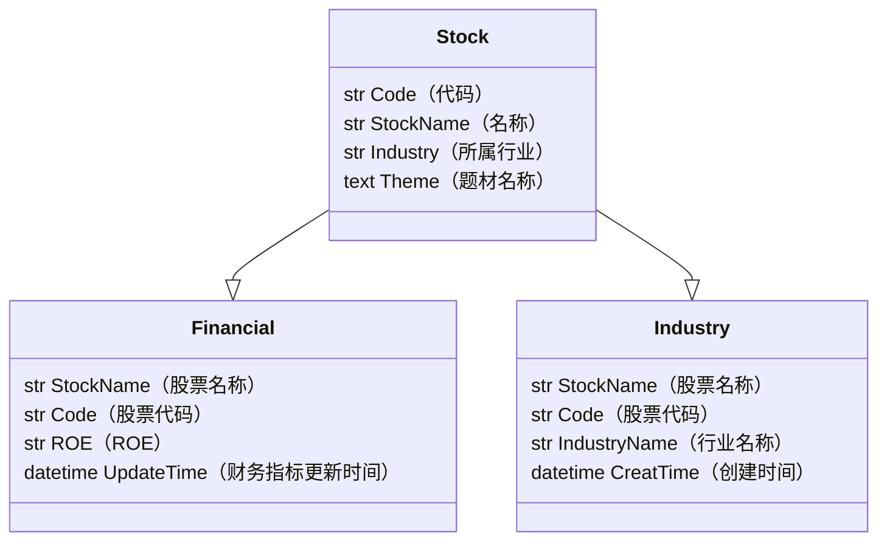

## 项目：六大指标选股
说明：按照行业进行筛选，找到每个行业的六大指标平均数，然后将每个行业高于指标和低于指标的股票都筛选出来


  
## 策略说明
#### 财务指标
* ROE ROE(股本报酬率) = 稅後淨利 / 股東權益
公司利用股東資金來賺錢的能力，推荐指标：近五年ROE平均>15%；
* 每股自由現金流 = 自由現金流 / 公司發行在外流通股數
自由現金流代表公司在支付必要支出後所剩餘可以自由使用的錢，觀察此指標可以判斷公司的用錢能力 ，推荐指标：近五年每股自由現金流平均>0元 
* 營業利益率 = 營業利益 / 營收
此項指標可以判斷公司是否依靠本業賺錢，可以補足僅看ROE指標的不足處。因為ROE指標的分子為稅後淨利，是包含公司業外損益的結果，因此當公司業外損益過高都會有所影響。 
除了希望公司主要依靠本業賺錢，也希望本業利潤夠高，因此將營業利益率設定為10%。 推荐指标：近五年營業利益率平均>10%
* 税后净利润率 = 營業現金流 / 稅後淨利 
稅後淨利是扣除一切成本後的預估損益；而營業現金流則代表實際依靠營業收付現金的情況。因此若實際收到的錢(營業現金流)小於稅後淨利，這個時候就必須小心避開，或進一步實際觀察公司財報。 
推荐指标：近一年營業現金流對稅後淨利比平均>50%
* 現在董監持股比率
指标5：現在董監持股比率>10%
我們會希望公司董事、監察人與股東站在同一條船上，所以當公司高層持有越多股票，代表與股東的利益越一致，公司經營不善的風險也會降低。
有些大型公司可能會另立其他投資公司的方式持股，整體來說持股還是高過10%，但這些股份不會顯示為董監事持有，這時此指標就會把這些公司篩選掉。 
* 現在董監質押比率
指标6：現在董監質押比率<10%
質押就是以股票做為抵押品借錢。若質押比率高，可能代表董監事缺錢，或著借錢投資(不務正業)等，長期來說還是會擔心動公司歪腦筋。 

#### 选股策略
1、每个指标分别计算行业平均值；  
2、以行业平均值为分界线，找出高于行业平均和低于行业平均的企业；  
3、高于行业平均值为好公司，低于行业平均值为坏公司；  
4、然后把六个指标中都属于好公司的企业挑出来；  
5、将这些挑出来的好公司进行排序显示；  


  
## 功能实现
### 功能目标
将值得推荐的好公司输出excel表，方便查看

|  股票名称   | 股票代码  | 所在行业  |  ROE  | 每股现金流  | 利润率  |  税后净利润  | 股东持股比例  | 股东质押比率  |
|  ----  | ----  | ----  | ----  | ----  | ----  | ----  | ----  | ----  |
| -- | -- | -- | -- | -- | -- | -- | -- | -- |


### 数据来源
* 1、行业信息：  
获取行业名单《东方财富-行业板块》（接口: stock_board_industry_name_em）  
货物行业成份股《东方财富-成份股》（接口: stock_board_industry_cons_em）   
* 2、股票财务指标：获取个股财务信息《财务指标》（接口: stock_financial_analysis_indicator）    
  
|  ----  | ----  | ----  | ----  | ----  | ---- |    
|ROE|每股现金流|利润率|税后净利润|股东持股比例|股东质押比率|
|股本报酬率(%)|每股经营性现金流(元)|营业利润率(%)|扣除非经常性损益后的净利润(元)|股东权益比率(%)| ----  |
|  ----  | ----  | ----  | ----  | ----  | ---- |


### 数据库设计


### 流程
```mermaid
%%{init: {'theme':'base'}}%%
        graph TD
          A[行业清单] -->|获取成份股 | B(股票清单)
          B -->|获取财务指标 | C(ROE)
          B -->|获取财务指标 | D(每股现金流)
          C -->|行业成份股ROE合计比行业成份股数量 | E(行业平均ROE)
          E -->|股票ROE大于行业平均ROE | F(好股票清单)
          C -->jslkkkwnlljfspjfop
          subgraph ROE
            C
            E
            F
          end
          
  ```


  
